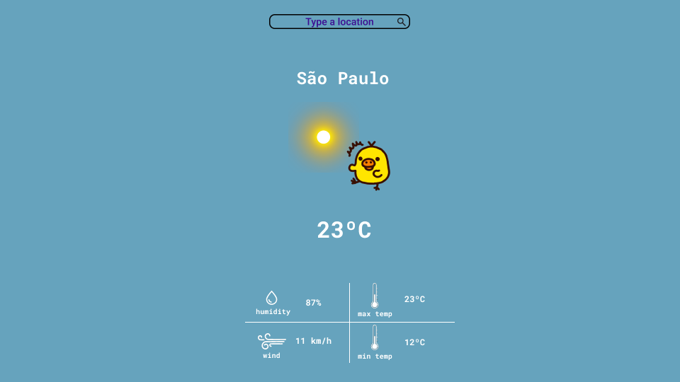
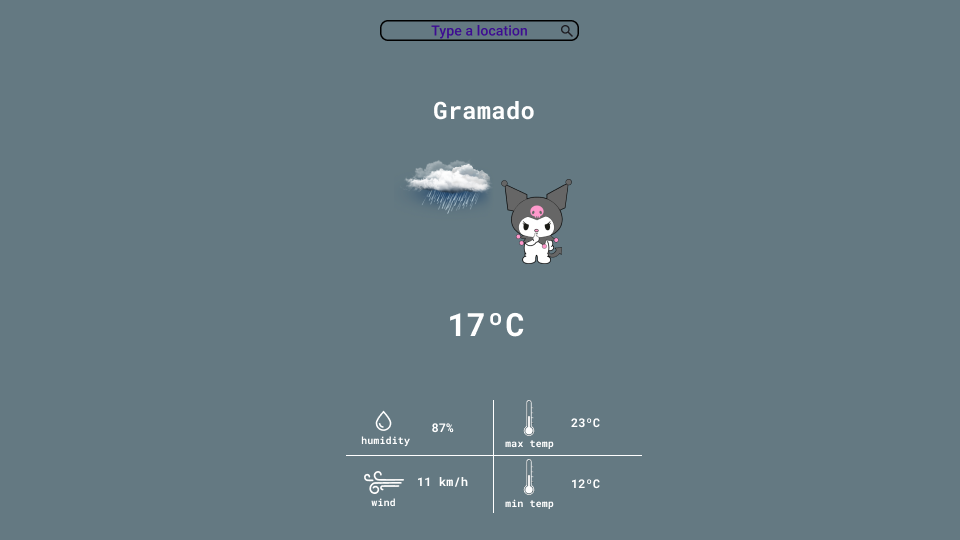
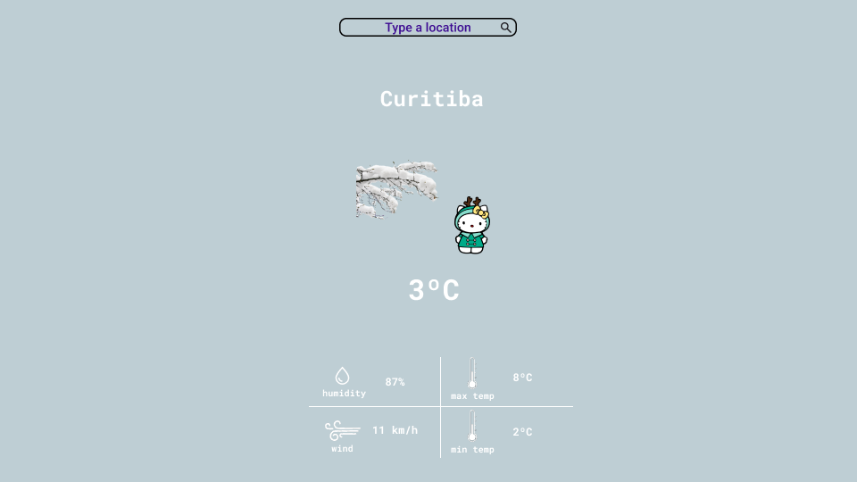
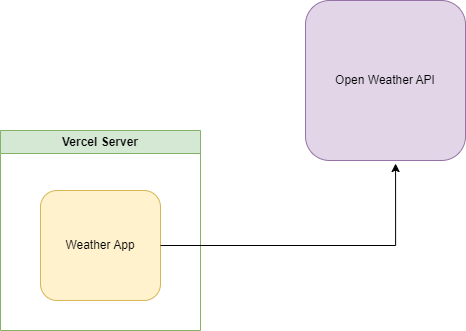
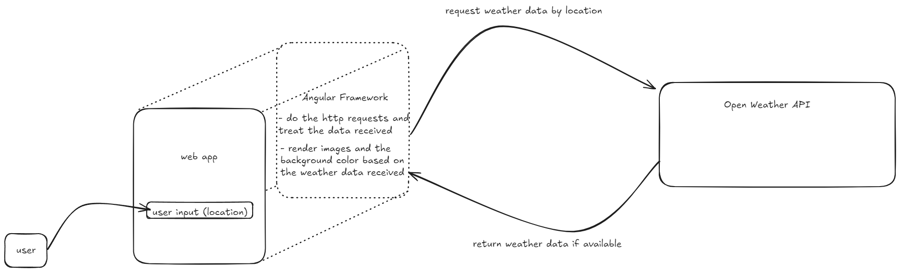

# Badtz-Maru's WeatherApp ☀️☁️🌦️
## How to access it? 🔗 https://angular-weather-app-smoky.vercel.app/ 🔗
## Design
</img>
_home page_

</img>
_weather [sunny]_

</img>
_weather [rainy]_

</img>
_weather [cold]_

## User Story
- #### Mr Badtz Maru is tired of leaving home with his umbrella without knowing if it is really going to rain. Yes he uses google and his weather app to get some information about the temperature and the rain chances, but he is not satisfied with those. Mr Badtz Maru needs a web application to get weather information, a good one that he can trust, that is why he came to us. Mr Badtz is a simple man, so he wants his web app so simple as him.
## Architecture
</img>
## Dependencies
- Angular Framework
- Vercel
- NodeJs
- OpenWeatherAPI
## Flow chart
</img>
## License
- There is not license on this project.
## Deployment
- The deployment is automated using CI/CD and Vercel.
## Creator
- Lucas Maesaka a.k.a **hidekimsk**
- hidekimsk.com
